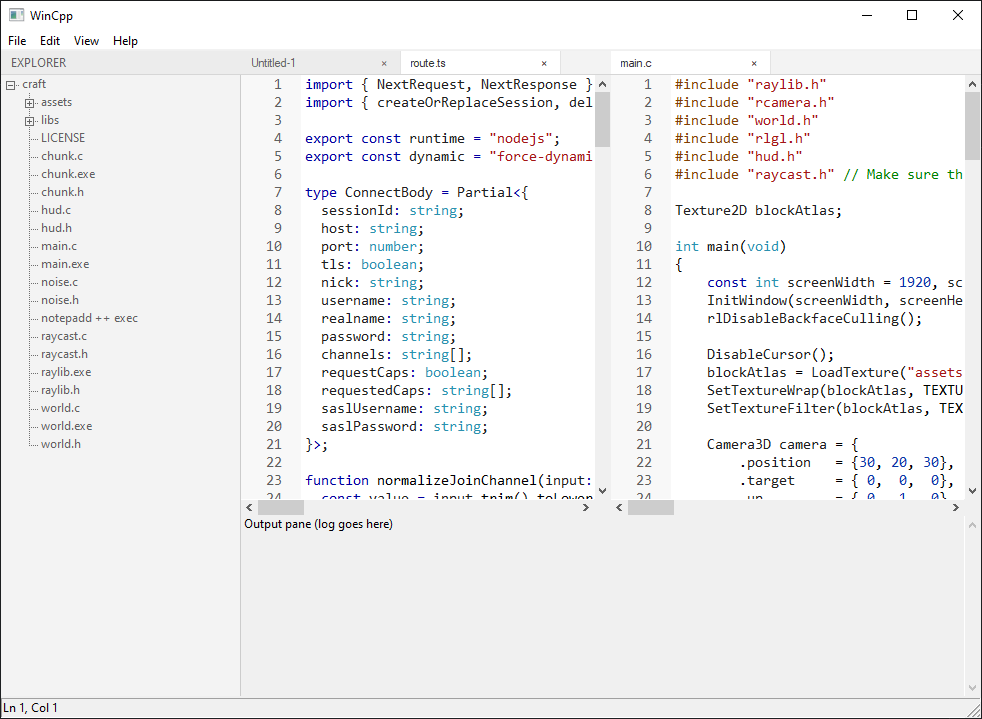

# WinCpp

A simple text editor for Windows, built with C++ and Win32. It uses [Scintilla](https://www.scintilla.org/) for editing.



## Features

- **Tabs** - Multiple open files, drag to reorder, close tab (`Ctrl+W`), and context menu (close / close others / close all)
- **Split editors** - VS Code-style editor groups: split right or down, drag tabs between panes with drop previews, merge by dropping in the center, close a group from the View menu (`Ctrl+\` splits right)
- **Editing** - Scintilla buffer per tab: undo/redo, cut/copy/paste, line numbers, caret line highlight, optional word wrap
- **Syntax highlighting** - Language detection from file extension and first-line hints; rules loaded from bundled [micro](https://github.com/zyedidia/micro) YAML syntax files (C/C++, Python, JSON, and many more)
- **Find & replace** - Find, replace, replace all, match case, whole word, forward/backward search; go to line
- **Project pane** - Open a folder and browse the tree; double-click a file to open it in a tab
- **Output pane** - Toggleable panel below the editor (View menu)
- **Recent files** - Open Recent submenu; list stored in `%APPDATA%\WinCpp\config.json`
- **Status bar** - Current line/column and file state

## Requirements

- Windows 10 or later
- Visual Studio 2022 or newer (with **Desktop development with C++**)
- CMake 3.10+
- Git (CMake downloads Scintilla, yaml-cpp, and PCRE2 automatically)

## Build

Open a **x64 Native Tools** command prompt (or run `vcvars64.bat`), then:

```bat
cd WinCpp
cmake -B out/build/x64-release -DCMAKE_BUILD_TYPE=Release
cmake --build out/build/x64-release --target WinCpp
```

The executable is at `WinCpp/out/build/x64-release/WinCpp/WinCpp.exe`.

You can also open `WinCpp/WinCpp.sln` in Visual Studio and build from there.

## Run

Run `WinCpp.exe`. Recent files are stored in `%APPDATA%\WinCpp\config.json`.

## Shortcuts

| Action        | Keys      |
|---------------|-----------|
| New file      | Ctrl+N    |
| Open file     | Ctrl+O    |
| Save          | Ctrl+S    |
| Find          | Ctrl+F    |
| Replace       | Ctrl+H    |
| Go to line    | Ctrl+G    |
| Close tab     | Ctrl+W    |

Use **Help > Credits** for third-party acknowledgements (Micro syntax files, Scintilla, and others).

## Tests

Unit and integration tests use [Google Test](https://github.com/google/googletest). From the same build directory as the app (use the **x64 Native Tools** environment so MSVC can compile dependencies):

```bat
cmake --build out/build/x64-release --target WinCppTests
ctest --test-dir out/build/x64-release/WinCpp/tests --output-on-failure
```

Or run `WinCppTests.exe` directly from `out/build/x64-release/WinCpp/tests/`.

### Feature coverage matrix

| Feature | Test suite(s) |
|---------|----------------|
| Tabs | `TabBarLogic`, `TabBarMessage`, `TabBar`, `EditorWorkspace` |
| Split editors | `EditorSplitDrop`, `EditorWorkspace` |
| Editing | `EditorView` |
| Syntax highlighting | `SyntaxRegistry`, `SyntaxHighlighter` |
| Find & replace | `EditorView` |
| Recent files | `RecentFilesStore` |
| Tab / window titles | `DocumentNaming` |
| UI fonts | `UiHelpers` |
| Regex syntax rules | `RegexPattern` |

**101 automated tests** cover testable logic for tabs, splits, editing, syntax, recents, regex rules, document naming, and workspace layout.

### Manual testing only

These flows are not automated (file/folder dialogs, full main window, or live drag rendering):

- **Open / Save As** and **Open Folder** common dialogs
- **Project tree** population and double-click open
- **Output pane** layout toggling with the full chrome
- **Find/Replace** and **Go to Line** modal dialogs
- Live **drag ghost** rendering during tab drag
- **Credits** dialog

## License

This project uses third-party libraries (Scintilla, yaml-cpp, PCRE2). See their respective licenses.
